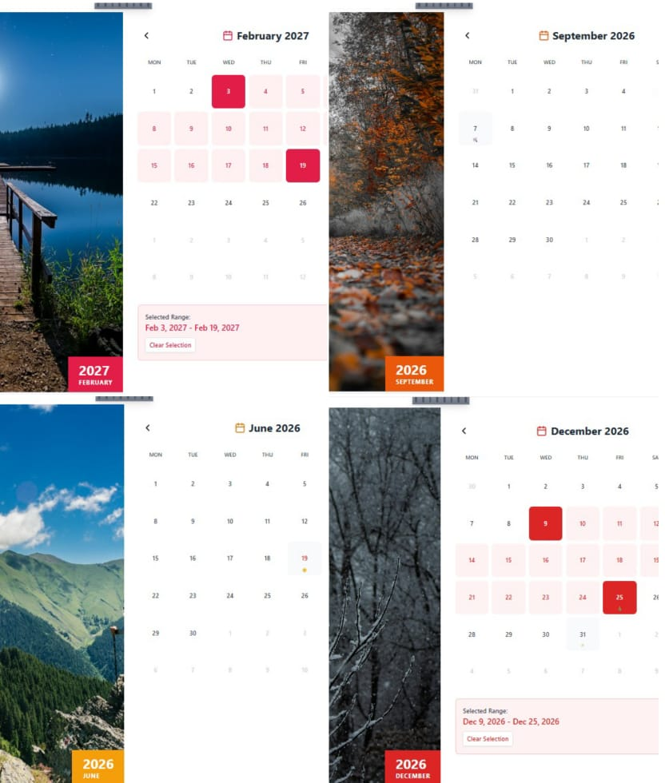
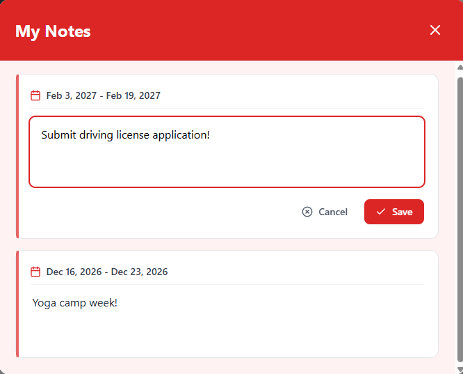

# 🗓️ Interactive Dynamic Calendar


A highly polished, interactive calendar application featuring **dynamic monthly color themes**, local note persistence, interactive holiday markers, and a beautiful UI built entirely with React and Tailwind CSS.

> 🚀 **[View Live Demo Here](#)** *(Add your Vercel/Netlify link here)*

---

## ✨ Features

- **🎨 Dynamic Seasonal Theming:** The calendar dynamically extracts color palettes for all buttons, rings, and backgrounds depending on the current month's landscape image.
- **📝 Persistent Local Notes:** Add, edit, and delete notes directly on the calendar. All data is persisted to your browser's local storage via a custom `useNotes` hook.
- **🎉 Custom Holiday Markers:** Special bespoke emojis and colored text to highlight specific holidays throughout the year (🎃 for Halloween, 🎄 for Christmas, etc.).
- **⚡ Beautiful Fluid UI:** Smooth 500ms color transitions across the entire application interface during month changes.
- **📅 Range Selection:** Click and select date ranges visually mapped onto the calendar grid!

---

## 🖼️ Screenshots

| Dynamic Themes | Notes Panel |
|:---:|:---:|
|  |  |

---

## 🏗️ Architecture & Technical Choices

1. **State Management:** Used native React hooks (`useState`, `useMemo`) combined with a bespoke `useNotes.ts` abstraction. This hook safely isolates `localStorage` interactions away from UI components.
2. **Dynamic Styling Strategy:** Instead of using heavy CSS-in-JS libraries or runtime generic classes, I built a `utils/theme.ts` dictionary containing explicit, purge-safe Tailwind classes. This ensures optimal production bundles while enabling complete UI palette morphs.
3. **Date Logic:** Opted to build vanilla Date object utilities (`utils/date.ts`) over importing heavy libraries like `date-fns` or `moment.js` to deeply minimize bundle size.

---

## 🚀 How to Run Locally

Follow these steps to set up the dev environment safely!

### Prerequisites
Make sure you have [Node.js](https://nodejs.org/) installed on your machine.

### Installation

1. **Clone the repository** (if not already local)
   ```bash
   git clone https://github.com/yashsri2802/interactive-calendar.git
   cd interactive-calendar
   ```

2. **Install dependencies**
   ```bash
   npm install
   ```

3. **Start the Development Server**
   ```bash
   npm run dev
   ```

4. **Enjoy the app!**
   Open your browser and navigate to `http://localhost:5173`.

---

## 🛠️ Tech Stack

- **Framework:** React 18
- **Build Tool:** Vite
- **Language:** TypeScript
- **Styling:** Tailwind CSS
- **Icons:** Lucide React

---
*Made with ❤️ by [yashsri2802](https://github.com/yashsri2802)*
